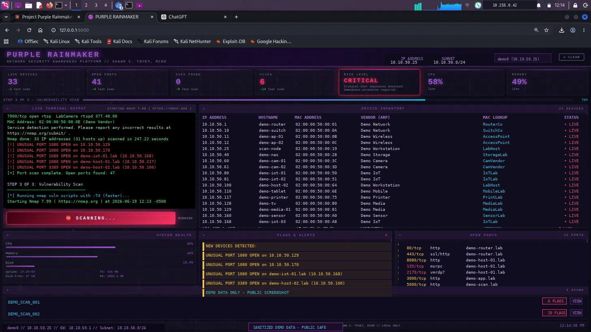

# Purple Rainmaker

A local network security awareness platform for home and small office use.

Purple Rainmaker runs automated 3-step network audits against your local subnet — ARP device discovery, port scanning, and vulnerability assessment — and streams results live to a browser-based dashboard. When the scan completes, it generates a PDF report with findings, risk level, CVE scores, and recommendations.



---

## What this is

This is a personal network awareness tool. It was built by someone who wanted a clear, honest picture of what was running on their home network — what devices were present, what ports were exposed, whether anything looked suspicious, and whether known CVEs had been flagged against their equipment.

It is **not** a substitute for a professional penetration test or a formal security assessment. It uses `nmap` and `arp-scan` — tools any security professional would recognize — but it does not attempt exploitation, credential testing, lateral movement, or anything beyond passive discovery and CVE fingerprinting via nmap scripts.

If you manage a home network, a small office, or physical security infrastructure and want a repeatable way to audit it, this may be useful to you. If you need a formal security assessment, please engage a qualified professional.

This is my first publicly released software. I built it to protect my family's network, to learn, and to share something useful with the community. Feedback, issues, and pull requests are genuinely welcome.

— Shawn C. Tovey, RCDD

---

## Features

- **Live dashboard** — real-time terminal output, device inventory, flags, and open ports stream as the scan runs
- **3-step automated audit** — ARP discovery → port scan → vulnerability assessment
- **Device baseline tracking** — detects new and offline devices compared to previous scans
- **Risk level** — triage indicator (Low / Medium / High / Critical) based on detected services and CVEs
- **CVE scoring** — CVSS scores and severity pulled from the NVD API at report time
- **PDF report** — auto-generated at scan completion with executive summary, device inventory, open ports, vulnerability assessment, and recommendations
- **Differential analysis** — scan-over-scan deltas for devices, ports, CVEs, and flags
- **Interface selector** — choose which network interface to scan (wlan, eth, etc.)

---

## Requirements

**Operating system:** Kali Linux, Debian, or Ubuntu (tested on Kali Purple 2026.2)

Not tested on macOS or Windows. `arp-scan` is Linux-only. Pull requests for other platforms are welcome.

**System packages** — installed automatically by `install.sh`:
- `nmap`
- `arp-scan`
- `weasyprint`
- `python3-pip`

**Python packages** — installed automatically:
- `flask`
- `flask-sock`
- `psutil`
- `weasyprint`

**Sudo access** is required for `nmap` and `arp-scan`. The install script configures a minimal sudoers entry — see [Sudo access](#sudo-access) below.

**Network:** An active local network interface (wlan0 or eth0). The tool auto-detects the subnet and scans it.

---

## Install

```bash
git clone https://github.com/scovey/purplerainmaker
cd purplerainmaker
bash install.sh
```

Open your browser at `http://localhost:5000/setup` to complete first-run configuration (credentials and report storage path).

The dashboard will be available at `http://localhost:5000` after setup.

---

## Update

```bash
git pull
bash update.sh
```

`update.sh` updates Python packages and restarts the app. It never overwrites your `config.py` or existing reports.

---

## First-run setup

On first launch, Purple Rainmaker redirects to `/setup` where you set:

- **Username and password** — used for HTTP Basic Auth on the dashboard
- **Reports directory** — where scan reports and PDFs are saved (defaults to `playbook/reports/` inside the project directory)

These settings are saved to `config.py` in the project root. This file is gitignored and never committed.

To reconfigure, delete `config.py` and restart the app.

---

## Usage

1. Open `http://localhost:5000` in your browser
2. Log in with your credentials
3. Click **⚡ INITIATE SCAN**
4. Watch results stream live — devices populate during Step 1, ports during Step 2, CVEs and risk level during Step 3
5. When the scan completes, a PDF report generates automatically and opens in a new tab

Scans take approximately 20–35 minutes on a typical home network with `-T4` timing. The vulnerability scan (Step 3) is the longest step.

Use the **CLEAR** button in the header to reset the dashboard between scans.

---

## Risk levels

Purple Rainmaker assigns a risk level to each scan based on the highest-severity condition detected:

| Level | Triggered by |
|---|---|
| **Critical** | Critical-tier port AND a CVSS ≥ 7.0 vulnerability on the same host, OR multiple critical-tier ports on the same host |
| **High** | Any critical-tier port open (RDP, Telnet, FTP, SNMP, SMTP, TFTP, VNC, etc.), OR any CVE with CVSS ≥ 7.0 |
| **Medium** | Unusual port (1080, 8888), new device detected, or CVE with CVSS 4.0–6.9 |
| **Low** | No significant findings |

Risk Level is a triage indicator. It is not a CVSS aggregate score and is not intended as a formal risk rating.

---

## Device baseline

On first scan, `autopilot.sh` creates `baseline_devices.txt` in your reports directory — a list of known IP addresses on your network. Subsequent scans compare against this file and flag new or missing devices.

To update the baseline after authorizing new devices, copy `live_hosts.txt` from your most recent scan report over `baseline_devices.txt`.

---

## Sudo access

`install.sh` creates `/etc/sudoers.d/purplerainmaker` with these entries:

```
youruser ALL=(ALL) NOPASSWD: /bin/bash /path/to/autopilot.sh
youruser ALL=(ALL) NOPASSWD: /usr/bin/nmap
youruser ALL=(ALL) NOPASSWD: /usr/sbin/arp-scan
```

This allows the dashboard to run network scans without prompting for a password. No wildcard arguments are permitted — `autopilot.sh` reads its configuration from `config.sh` rather than accepting shell arguments. These are the only elevated privileges Purple Rainmaker uses. You can review or remove this file at `/etc/sudoers.d/purplerainmaker` at any time.

---

## Report storage

Each scan creates a timestamped directory:

```
playbook/reports/
└── 20260619_1209/
    ├── summary.txt
    ├── flags.txt
    ├── arp_full.txt
    ├── live_hosts.txt
    ├── port_scan.txt
    ├── vuln_scan.txt
    ├── cvss_cache.json
    └── Network_Security_Audit_20260619_1209.pdf
```

`config.sh` (in the project root, gitignored) holds the reports directory path for `autopilot.sh`. It is generated automatically by `install.sh` and by the setup page.

The reports directory is gitignored. Your scan data stays on your machine.

---

## Known limitations

- CVE detection relies on nmap script fingerprinting, which is heuristic and not exhaustive. Results can include false positives, and not all vulnerabilities are detectable this way. The PDF report notes confidence levels accordingly.
- CVSS scores are fetched from the NVD API at report generation time. If the API is unavailable or the CVE is not in the NVD database, scores will show as unavailable.
- Scan results vary slightly between runs. This is normal nmap behavior, not a bug.
- The dashboard uses HTTP Basic Auth and is designed for local network use only. Do not expose port 5000 to the internet.
- Tested on Kali Purple 2026.2. Other Debian/Ubuntu-based distributions should work but have not been formally tested.

---

## Contributing

Issues and pull requests are welcome.

If you find a false positive, a crash, or something that doesn't make sense — please open an issue. This project is actively maintained and feedback makes it better.

If you're submitting a PR: match the existing style, keep changes minimal and focused, and describe what problem you're solving.

---

## License

MIT — see [LICENSE](LICENSE)

© 2026 Shawn C. Tovey, RCDD
